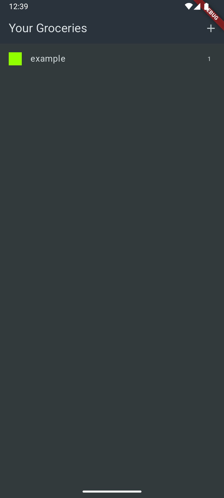
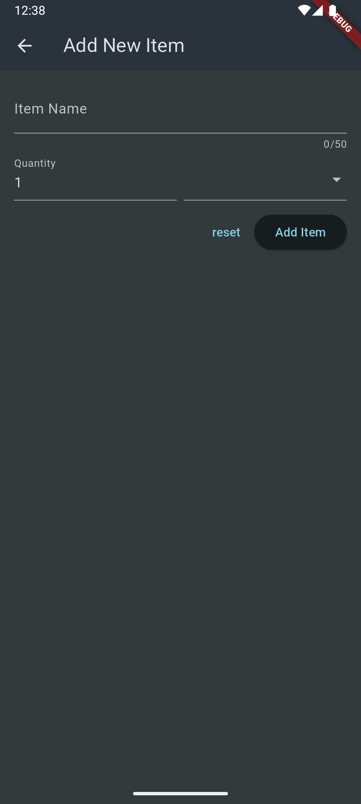

# 🛒 Shopping List

[](https://flutter.dev/)
[](https://dart.dev/)
[](LICENSE)

---

## 📖 About The Project

**Shopping List** is a Flutter app designed to help users keep track of their grocery shopping.  
Users can add items, select categories like fruits, vegetables, meat, etc., specify quantities, and save the list for quick access.

---

## 🚀 Features

- ➕ Add new shopping items with title and quantity.
- 🗂️ Categorize items by types such as fruits, vegetables, meat, and more.
- 💾 Save and manage your shopping list.
- 🛍️ Simple and clean user interface for easy usage.

---

## 🛠️ Built With

| Technology  | Description                             |
|-------------|---------------------------------------|
|   | UI toolkit for building natively compiled apps |
|       | Programming language used                  |

---

## 📸 Screenshots

### Home Screen


### Add Item Screen


---

## ⚙️ Installation & Setup

1. Make sure you have [Flutter](https://flutter.dev/docs/get-started/install) installed.
2. Clone the repository:
   ```bash
   git clone https://github.com/yourusername/shopping_list.git
3.	Navigate to the project folder:
    cd shopping_list
4.	Get the dependencies:
    flutter pub get
5.	Run the app:
    flutter run

🤝 Contributing

Contributions are welcome! Open an issue or submit a pull request.

⸻

📄 License

Distributed under the MIT License. See LICENSE for details.

⸻

📫 Contact

Created by fares salah
Feel free to reach out via [LinkedIn](https://eg.linkedin.com/in/fares-salah-86a751354)
